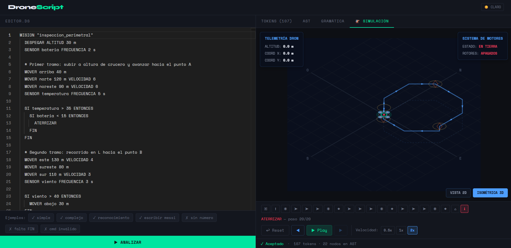
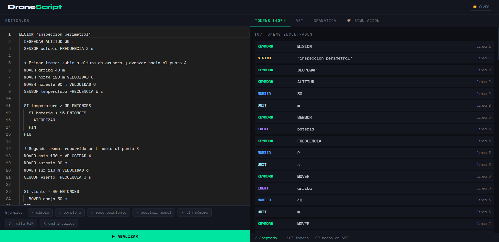
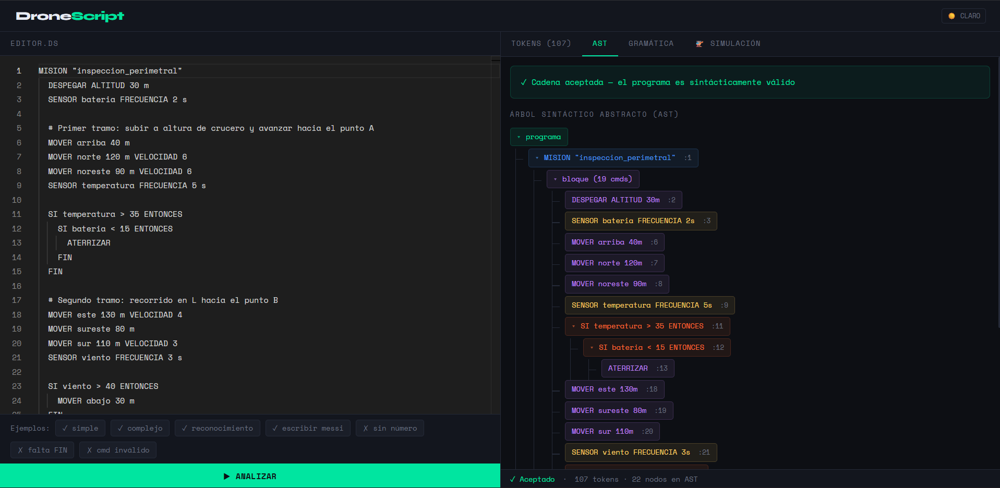
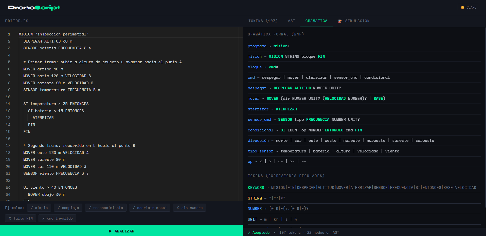

# DroneScript

> Lenguaje de dominio específico (DSL) para planificar, validar y simular misiones de drones — con lexer y parser LL(1) implementados desde cero en TypeScript, y un IDE web interactivo con simulación en tiempo real.

**🔗 [Probar la demo en vivo →](https://drone-script.vercel.app/)**

[](https://github.com/TFacund0/DroneScript/actions/workflows/ci.yml)


[](https://drone-script.vercel.app/)



<details>
<summary>Ver también: panel de tokens, AST y gramática</summary>

|                    Tokens                    |                 AST                 |                     Gramática                     |
| :-------------------------------------------: | :----------------------------------: | :-------------------------------------------------: |
|  |  |  |

</details>

## ¿Qué es?

DroneScript es un proyecto de **Teoría de la Computación** que implementa el frontend completo de un compilador para un lenguaje de misiones de vuelo:

```
MISION "patrulla_campo"
  DESPEGAR ALTITUD 100 m
  MOVER norte 200 m VELOCIDAD 5
  SENSOR temperatura FRECUENCIA 10 s
  SI bateria < 20 ENTONCES
    ATERRIZAR
  FIN
  MOVER BASE
  ATERRIZAR
FIN
```

El código se analiza en vivo mientras escribís: se tokeniza, se parsea, se construye el AST y se simula el vuelo del dron en un visualizador interactivo.

## Características

- **Lexer hecho a mano** con recuperación de errores: los caracteres inválidos se reportan sin detener el análisis.
- **Parser descendente recursivo LL(1)** que construye un Árbol de Sintaxis Abstracta (AST) tipado y reporta errores sintácticos con línea y columna.
- **Gramática demostrada LL(1)**: los conjuntos FIRST y FOLLOW de cada no-terminal están documentados en [`docs/first_follow.md`](docs/first_follow.md).
- **Análisis semántico**: valida reglas que la gramática no puede expresar — mover el dron antes de despegar, despegues duplicados, misiones que terminan en el aire, condiciones físicamente imposibles (`bateria > 150`) — distinguiendo errores de advertencias.
- **Diagnostics en el editor**: los errores se subrayan en rojo (y las advertencias en amarillo) directamente sobre el código, como en VS Code.
- **IDE web** con editor Monaco (el de VS Code), paneles de tokens, AST navegable, gramática y errores.
- **Simulador visual** que interpreta el AST y anima la trayectoria del dron (direcciones, altitud, velocidad, sensores y condicionales).
- **Suite de tests**: unitarios para lexer y parser (Vitest) + pipeline de integración sobre un catálogo de casos válidos e inválidos ([`tests/cases.json`](tests/cases.json)).

## El lenguaje

| Instrucción | Sintaxis | Ejemplo |
| :--- | :--- | :--- |
| Misión | `MISION "nombre" ... FIN` | `MISION "vuelo" ... FIN` |
| Despegue | `DESPEGAR ALTITUD <n> [unidad]` | `DESPEGAR ALTITUD 50 m` |
| Movimiento | `MOVER <dirección> <n> [unidad] [VELOCIDAD <n>]` | `MOVER norte 200 m VELOCIDAD 5` |
| Retorno | `MOVER BASE` | `MOVER BASE` |
| Aterrizaje | `ATERRIZAR` | `ATERRIZAR` |
| Sensor | `SENSOR <tipo> FRECUENCIA <n> [unidad]` | `SENSOR viento FRECUENCIA 5 s` |
| Condicional | `SI <sensor> <op> <n> ENTONCES <cmd>` | `SI bateria < 20 ENTONCES ATERRIZAR` |

**Direcciones:** `norte`, `sur`, `este`, `oeste`, `noreste`, `noroeste`, `sureste`, `suroeste`, `arriba`, `abajo` · **Sensores:** `temperatura`, `bateria`, `altura`, `velocidad`, `viento` · **Operadores:** `<`, `>`, `<=`, `>=`, `==` · Los condicionales se pueden anidar y `#` inicia un comentario de línea.

## Arquitectura

```
Código fuente ──▶ Lexer ──▶ Tokens ──▶ Parser ──▶ AST ──▶ Semántico ──▶ Simulador / Paneles
                    │                    │                   │
                    └── errores léxicos ─┴─ err. sintácticos ┴─ err. y advertencias semánticas
```

El proyecto es un monorepo (pnpm workspaces) que separa el compilador de la interfaz:

```
packages/
├── core/               # @dronescript/core — el compilador (TypeScript puro, sin UI)
│   └── src/
│       ├── lexer.ts    #   Análisis léxico con recuperación de errores
│       ├── parser.ts   #   Parser descendente recursivo LL(1) → AST
│       ├── semantic.ts #   Análisis semántico (estado de vuelo, rangos físicos)
│       ├── simulator.ts#   Motor de simulación: AST → trayectoria del dron
│       ├── pipeline.ts #   Orquesta las tres fases: analyze(código)
│       └── __tests__/  #   Tests unitarios de cada fase
└── cli/                # @dronescript/cli — validador de misiones por terminal
src/                    # Web app (React): editor Monaco, paneles y visualizador
├── components/
├── hooks/useAnalyzer.ts  # Conecta @dronescript/core con React
└── constants/
examples/               # Misiones .ds de ejemplo para el CLI
tests/                  # Runner de integración + catálogo de casos (cases.json)
docs/first_follow.md    # Demostración formal de que la gramática es LL(1)
```

Como `@dronescript/core` no depende de React ni del navegador, el mismo compilador alimenta la web app, el CLI y los tests — y podría transpilarse a plataformas reales (PX4, ArduPilot, SDKs de fabricante).

## CLI

Las misiones también se pueden validar desde la terminal, sin abrir el navegador:

```bash
pnpm check examples/patrulla.ds
# ✓ examples/patrulla.ds es una misión válida (28 tokens)

pnpm check examples/invalida.ds
# error examples/invalida.ds:2 Error semántico en línea 2: MOVER antes de DESPEGAR (el dron no está en vuelo)
# error examples/invalida.ds:4 Error semántico en línea 4: 'bateria' solo puede valer entre 0 y 100% ...
# advertencia examples/invalida.ds:1 ... la misión termina sin ATERRIZAR, el dron queda en el aire
# ✗ 2 errores, 1 advertencia
```

El comando sale con código `1` si hay errores, por lo que sirve como paso de validación en pipelines de CI.

## Empezar

Requisitos: **Node.js 18+** y **pnpm** (o npm/yarn).

```bash
pnpm install      # instalar dependencias
pnpm dev          # servidor de desarrollo → http://localhost:5173
```

Otros comandos:

| Comando | Descripción |
| :--- | :--- |
| `pnpm build` | Chequeo de tipos + build de producción en `./dist` |
| `pnpm preview` | Sirve localmente el build de producción |
| `pnpm typecheck` | Solo verificación de tipos de TypeScript |
| `pnpm lint` | ESLint sobre todo el proyecto |
| `pnpm format` | Formatea el código con Prettier |
| `pnpm test` | Tests unitarios de lexer, parser, semántico, simulador y CLI |
| `pnpm test:watch` | Tests en modo watch |
| `pnpm test:coverage` | Tests unitarios con reporte de cobertura |
| `pnpm test:integration` | Pipeline completo sobre `tests/cases.json` |
| `pnpm check <archivo.ds>` | Valida una misión desde la terminal (CLI) |

## Fundamento teórico

La gramática fue factorizada por izquierda para eliminar ambigüedades (p. ej. `MOVER dirección ...` vs `MOVER BASE`) y se verificó la condición LL(1): para cada no-terminal, los conjuntos FIRST de sus alternativas son disjuntos, y donde existe la producción vacía, FIRST y FOLLOW también lo son. La tabla completa está en [`docs/first_follow.md`](docs/first_follow.md).

Esto garantiza que el parser descendente recursivo decide cada derivación con **un solo token de anticipación**, sin backtracking.

## Roadmap

- [x] Análisis semántico (estado de vuelo, rangos de sensores, misiones sin `ATERRIZAR`)
- [x] Diagnósticos en el editor (subrayado de errores y advertencias en Monaco)
- [x] Monorepo: compilador extraído como `@dronescript/core` + CLI (`pnpm check mision.ds`)
- [x] Integración continua (lint + tipos + tests + cobertura + build en cada push)
- [x] Demo desplegada en Vercel

Ideas fuera de alcance por ahora (el proyecto cumplió su objetivo académico): geofencing con límites espaciales verificados estáticamente.

## Contexto académico

Proyecto desarrollado para la cátedra **Teoría de la Computación** (Licenciatura en Sistemas de Información), como aplicación práctica de análisis léxico, gramáticas libres de contexto y parsing LL(1).

## Licencia

Distribuido bajo la licencia [MIT](LICENSE).
